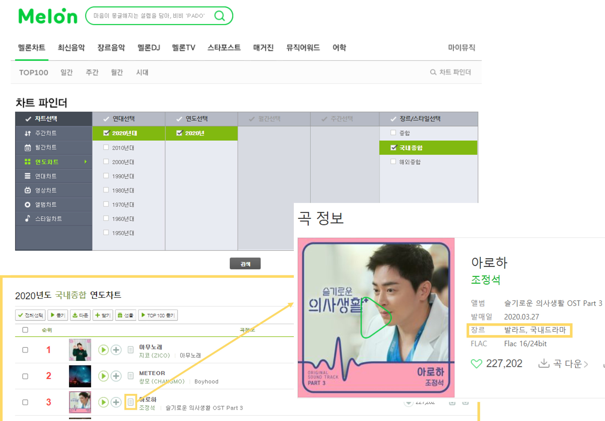
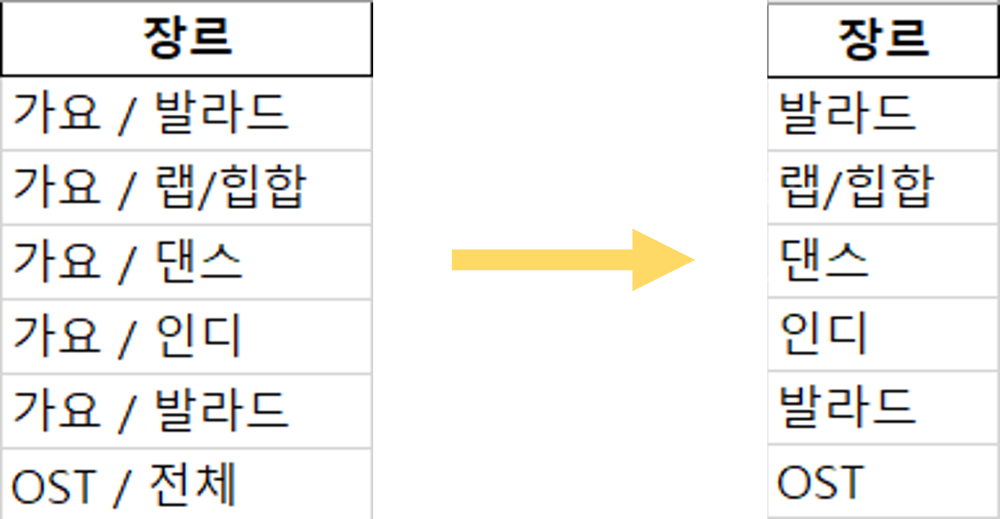

# 음원 차트를 이용한 트렌드 분석

📅 2021.09.02 - 2021.09.14

음원 차트 분석을 통해 계절별 선호 장르와 문장형 제목의 유행, 시기에 관계 없이 인기있는 가수 등에 대해 알아본다.

 

## 개발 도구

 

## 데이터 수집

- 지니 뮤직(Genie)의 월간 차트와 연간 차트 Top100 동적 크롤링

  > [지니 웹 크롤링 코드](./01.Web_Crawling/Genie_Web_Crawler.ipynb)

  - 연도, 월, 순위, 타이틀, 가수, 장르 추출

- 멜론(Melon) 연간 차트 Top100 동적 크롤링

  > [멜론 웹 크롤링 코드](./01.Web_Crawling/Melon_Web_Crawler.ipynb)

  - 연도, 월, 순위, 타이틀, 가수, 장르 추출

 

## 데이터 전처리

> [데이터 전처리 코드](./02.Data_Analysis_Visualization/01.Data_Preprocessing.ipynb)

- 장르 수정
  - '가요/...', 'POP/...' 등 뒤에 써진 세부 장르로 변경
  - '가요/전체'로 표시된 장르는 멜론에서 찾은 후 변경
  - OST/드라마', 'OST/해외영화' -> OST로 통일

- 계절별 데이터 추출

 

## 데이터 분석 및 시각화

:point_down:주제별 주피터 노트북 코드:point_down: 

> [계절별 장르 분포 - 가을](./02.Data_Analysis_Visualization/02.Data_Analysis_Visualization_Genre_Fall.ipynb)
>
> [가수 분포](./02.Data_Analysis_Visualization/03.Data_Analysis_Visualization_Singer.ipynb)
>
> [제목 길이 분석](./02.Data_Analysis_Visualization/04.Data_Analysis_Visualization_title.ipynb)
>
> [제목에 들어가는 단어 빈도](./02.Data_Analysis_Visualization/05.Data_Analysis_Visualization_titleword.ipynb)

 

## 웹 페이지 구현

> [웹 페이지 코드](./03.Web_Page/MusicChartAnalysis)

결과 그래프와 분석 내용을 담은 웹페이지 구현 

#### 웹 시연

메인

 

장르 분석

 

제목 분석

 

가수 분석

